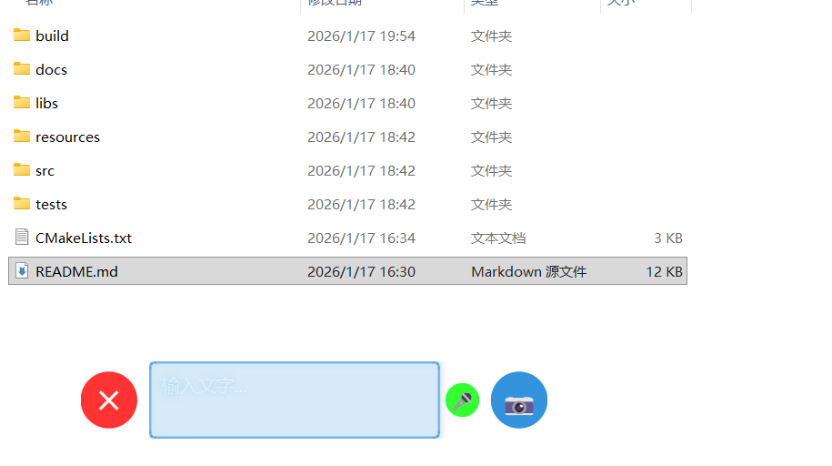

# V8 - Qt6 桌面智能助手软件

一个基于Qt6 widget开发的桌面助手应用程序，提供文本输入、语音识别、相机功能，并集成AI大模型对话能力。

## 功能特性

- **文本输入与编辑**：提供多行文本输入框，支持键盘输入
- **语音识别**：集成Vosk语音识别引擎，支持中文语音转文字，实时显示识别结果
- **相机功能**：一键启动摄像头预览
- **AI对话**：通过Ollama本地大模型处理用户输入，实现智能对话
- **屏幕内容识别**：实时扫描屏幕内容并进行OCR识别，每秒30次扫描
- **桌面悬浮显示**：AI回复和屏幕识别结果在桌面上实时悬浮展示
- **现代化UI**：半透明工具栏，居中显示，适配屏幕下方布局

## 软件架构

项目采用模块化设计，主要组件包括前端Qt widget界面层和后端C++业务逻辑层。后端各功能模块编译为动态库（DLL），供Qt widget前端通过Qt的信号槽机制调用。整体架构遵循MVC模式，其中Qt widget负责视图（View）和部分控制器（Controller），C++负责模型（Model）和核心业务逻辑。

### 整体架构图

```
+------------------+     +---------------------+
|  Qt widget UI    |     |   C++ Backend       |
|   (View/Controller)   |<--->|   (Model/Logic)     |
+------------------+     +---------------------+
          |                        |
          |                        |
+------------------+     +---------------------+
|   模块接口       |     |   动态库 (DLL)      |
+------------------+     +---------------------+
          |                        |
          |                        |
+---------------------------------------------+
|         Qt6 Framework                      |
+---------------------------------------------+
          |
+---------------------------------------------+
|  系统库 (Ollama, Tesseract, Multimedia)   |
+---------------------------------------------+
```

### 模块设计

#### 1. 主程序 (Main Executable)
- **功能**：应用程序入口点，负责初始化Qt应用和主窗口。
- **技术**：C++，Qt Widgets。
- **输出**：V8.exe
- **组件**：
  - main.cpp：程序入口
  - MainWindow：主界面窗口

#### 2. UI界面模块 (UI Module)
- **功能**：包含主窗口、动画库、组件库和资源管理，提供完整的用户界面解决方案。
- **技术**：Qt Widgets + C++。
- **输出**：AnimationLib.dll
- **子模块**：
  - mainwindow/：主应用程序窗口目录
    - mainwindow.h：主窗口头文件
    - mainwindow.cpp：主窗口实现
  - styles/：样式和动画库目录
    - animationlib.h：动画库头文件
    - animationlib.cpp：动画库实现
    - CMakeLists.txt：构建配置
  - widgets/：自定义UI组件目录（预留扩展）
  - resources/：资源文件目录（预留扩展）
- **与后端交互**：通过信号槽机制调用其他模块。

#### 3. 语音识别模块 (Speech Module)
- **功能**：集成麦克风库，支持语音转文字。
- **技术**：C++，Qt Multimedia，语音识别引擎。
- **输出**：speech.dll
- **接口**：startRecording(), stopRecording(), getText() 等方法。

#### 4. 相机模块 (Camera Module)
- **功能**：一键启动摄像头预览。
- **技术**：C++，Qt Multimedia。
- **输出**：camera.dll
- **接口**：startPreview(), stopPreview(), captureImage() 等方法。

#### 5. AI对话模块 (AI Module)
- **功能**：与Ollama本地大模型交互，实现智能对话。
- **技术**：C++，Qt Network，HTTP请求。
- **输出**：ai.dll
- **接口**：sendMessage(text), receiveResponse() 等方法。
- **集成**：调用本地Ollama API (http://localhost:11434)。

#### 6. OCR识别模块 (OCR Module)
- **功能**：实时屏幕扫描和OCR识别，每秒30次。
- **技术**：C++，Qt GUI (屏幕截图)，Tesseract OCR。
- **输出**：ocr.dll
- **接口**：startScanning(), stopScanning(), getRecognizedText() 等方法。

#### 7. 悬浮显示模块 (Overlay Module)
- **功能**：在桌面上悬浮显示AI回复和OCR结果。
- **技术**：C++，Qt Widgets (透明窗口)，Qt widget集成。
- **输出**：overlay.dll
- **接口**：showText(text), updatePosition() 等方法。

### 模块间通信

- **Qt widget与C++**：使用QObject子类注册到Qt widget，通过信号槽机制通信。
- **动态库加载**：主程序启动时动态加载各模块DLL，确保模块化部署。
- **事件驱动**：各模块通过Qt的信号槽机制实现解耦通信。

### 性能优化

- 高效率业务（如OCR处理、AI推理）采用C++实现，避免性能瓶颈。
- 异步处理：语音识别、AI对话等操作采用多线程异步执行，不阻塞UI。
- 内存管理：合理使用Qt的对象树和智能指针，防止内存泄漏。

### 平台支持

- **操作系统**：Windows 11/10
- **编译器**：MinGW64 (GCC for Windows)
- **Qt版本**：6.x (安装路径：C:\Qt)
- **依赖库**：
  - Ollama (本地AI模型服务)
  - Vosk (语音识别引擎)
  - Tesseract (OCR引擎)
  - OpenCV (计算机视觉库)
  - Qt Multimedia (音频/视频处理)

#### Vosk 安装
Vosk库已包含在项目libs目录中，无需额外安装。项目使用中文语音识别模型(vosk-model-cn-0.22)。

#### OpenCV 安装
OpenCV库已包含在项目libs目录中，无需额外安装。项目使用OpenCV 4.1.20版本。

#### Tesseract 安装
1. 下载并安装Tesseract OCR：[github.com/UB-Mannheim/tesseract/wiki](https://github.com/UB-Mannheim/tesseract/wiki)
2. 确保安装中英文语言包
3. 添加到系统PATH环境变量

#### Qt6 安装
从[Qt官网](https://www.qt.io/download)下载并安装Qt6，确保包含以下组件：
- Qt Core
- Qt Widgets
- Qt Multimedia
- Qt Network

#### Ollama 安装
1. 下载并安装Ollama：[ollama.ai](https://ollama.ai)
2. 拉取AI模型：
   ```bash
   ollama pull gpt-oss:120b-cloud
   ```

## 构建步骤

### 自动构建脚本（推荐）
项目提供了自动构建脚本，可一键完成编译和部署：

```bash
# Windows PowerShell
.\build.ps1
```

或

```bash
# 命令提示符
build.bat
```

### 手动构建步骤

1. **克隆或下载项目**
   ```bash
   cd C:\Users\huiya\Desktop
   # 项目已位于 V8/ 目录
   ```

2. **创建构建目录**
   ```bash
   mkdir V8/build
   cd V8/build
   ```

3. **配置CMake**
   ```bash
   cmake -S .. -B . -G "MinGW Makefiles"
   ```

4. **编译项目**
   ```bash
   cmake --build .
   ```

5. **部署Qt依赖**
   ```bash
   C:\Qt\6.10.1\mingw_64\bin\windeployqt.exe V8.exe
   ```

6. **构建结果**
   成功编译后，构建目录将包含以下文件：
   - `V8.exe`：主应用程序可执行文件
   - `libAnimationLib.dll`：UI动画库动态库
   - `libSpeech.dll`：语音识别模块动态库
   - `libCamera.dll`：相机模块动态库
   - `libAI.dll`：AI对话模块动态库
   - `libOCR.dll`：OCR识别模块动态库
   - `libOverlay.dll`：悬浮显示模块动态库
   - `Qt6*.dll`：Qt运行时库
   - `libvosk.dll`：语音识别库
   - 其他依赖库和资源文件

### 环境要求

- **CMake**: 3.16+
- **Qt6**: 6.10.1 (mingw_64)
- **MinGW**: GCC 13.1.0 (包含在Qt安装中)
- **Windows**: 10/11

### 依赖项版本

- **Vosk**: 0.3.45 (中文模型 vosk-model-cn-0.22)
- **OpenCV**: 4.1.20
- **Tesseract**: 5.x
- **Ollama**: 最新版本

## 使用方法

### 启动程序
双击 `V8/build/V8.exe` 运行程序。

### 界面说明
程序启动后在屏幕下方居中显示输入框，输入框左边旁边是关闭按钮，右边旁边是相机按钮，麦克风按钮在输入框内部最右边，发送按钮在输入框有输入时麦克风按钮变成发送按钮，包含：
- **关闭按钮** (✕)：退出程序
- **输入框**：多行文本编辑区域
- **麦克风按钮** (🎤)：语音输入模式
- **发送按钮**：发送文本给AI处理
- **相机按钮** (📷)：启动摄像头

### AI对话流程
1. **启动Ollama服务**：
   ```bash
   ollama serve
   ```

2. **输入文本**：
   - 在输入框中输入要发送给AI的问题或内容
   - 或点击麦克风按钮进行语音输入

3. **发送处理**：
   - 点击"发送"按钮
   - 程序将文本发送给本地Ollama服务
   - AI模型处理后返回结果

4. **查看结果**：
   - AI回复内容自动在桌面上悬浮显示
   - 支持实时更新

### 语音输入
1. 点击麦克风按钮进入语音模式
2. 说话输入内容
3. 再次点击麦克风或发送按钮完成输入

### 相机功能
点击相机按钮启动摄像头预览窗口。

### 屏幕内容识别
1. **启动识别**：
   - 在输入框中输入"扫描屏幕"
   - 点击"发送"按钮开始实时扫描

2. **识别过程**：
   - 程序每秒截取30次屏幕图像
   - 使用Tesseract-OCR进行中英文文字识别
   - 识别结果实时在桌面上悬浮显示

3. **停止识别**：
   - 关闭程序或重新输入其他命令停止扫描

## 故障排除

### 语音识别相关问题

**问题**: 程序启动时显示"Cannot load library libvosk.dll"
**解决方案**:
1. 确保已运行构建步骤中的Qt部署命令：`windeployqt V8.exe`
2. 检查build目录是否包含所有Vosk DLL文件
3. 重新编译项目：`cmake --build .`

**问题**: 语音识别没有反应或不准确
**解决方案**:
1. 检查麦克风权限和硬件连接
2. 确保使用安静环境录音
3. 检查Vosk模型文件是否完整（vosk-model-cn-0.22目录）
4. 查看控制台输出中的调试信息

**问题**: "无法找到入口"错误
**解决方案**:
1. 运行`windeployqt V8.exe`部署Qt依赖
2. 确保所有Qt6 DLL都在build目录中
3. 检查MinGW版本与Qt版本匹配

### AI对话相关问题

**问题**: AI回复显示"AI Error"
**解决方案**:
1. 确保Ollama服务正在运行：`ollama serve`
2. 检查模型是否已下载：`ollama pull gpt-oss:120b-cloud`
3. 验证网络连接到localhost:11434

### 构建相关问题

**问题**: CMake配置失败
**解决方案**:
1. 确保Qt6安装正确，路径为C:\Qt\6.10.1\mingw_64
2. 添加Qt到系统PATH：`C:\Qt\6.10.1\mingw_64\bin`
3. 使用正确的生成器：`-G "MinGW Makefiles"`

**问题**: 编译错误
**解决方案**:
1. 清理构建目录：`rmdir /s build && mkdir build`
2. 重新配置：`cmake -S .. -B .`
3. 检查MinGW版本与Qt兼容性

### 运行相关问题

**问题**: 程序闪退或无响应
**解决方案**:
1. 查看控制台输出错误信息
2. 确保所有依赖库都在PATH中
3. 检查硬件兼容性（音频设备、摄像头）

**问题**: 界面显示异常
**解决方案**:
1. 确保系统支持透明窗口
2. 检查显卡驱动
3. 尝试以兼容模式运行

## 更新日志

### v8.1 (最新)
- ✅ 完善语音识别功能，使用Vosk中文模型
- ✅ 修复Qt ABI兼容性问题
- ✅ 优化音频数据处理，实时显示识别结果
- ✅ 改进构建流程，使用windeployqt自动部署
- ✅ 重新组织UI模块目录结构
  - 主窗口文件移至 mainwindow/ 子目录
  - 动画库重命名为 styles/ 目录
  - 新增 widgets/ 和 resources/ 目录为未来扩展
- ✅ 更新CMake构建配置以适应新目录结构
- ✅ 集成AnimationLib动画效果到UI组件
- ✅ 更新文档和故障排除指南

### v8.0
- 初始版本，实现基本框架和模块化设计

## 许可证

本项目采用MIT许可证。详见LICENSE文件。

## 贡献

欢迎提交Issue和Pull Request来改进项目。

## 联系方式

如有问题或建议，请通过GitHub Issues联系。

## 效果


